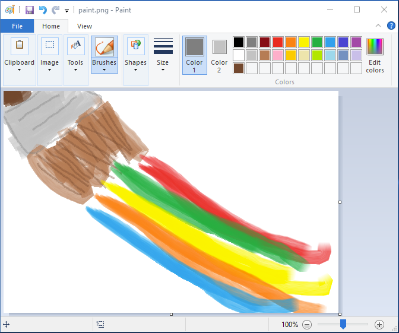

# Paint

SASS building microservice.

[](https://heroku.com/deploy)



## Usage

Check the [app.json](app.json) file for any environment variables you might need to add or want to replace. Settings `ENVIRONMENT` to `[value]` will cause the app to try and load the `.env/[value]` file into your environment. This is an easy way to add variables, but don't use this for confidential information.

```
npm install
npm start
```

## API

### `/`

Display information about the Paint service.

### `/paint`

Compile SASS into CSS.

__Parameters:__

- `src`: The source SASS to compile. Either plain SASS, a link to an SASS file or a link to a (optionally gzipped) tarball containing SASS files. In case of an archive, there needs to be a `style.scss` file in the root.

- `var`: Array of SASS variables to use during compilation. E.g. `?var[primary]=green` will result in `$primary: green;`

- `uvar`: Link to a JSON file that contains SASS variables to use during compilation. Example JSON below.

```
{
    "primary": "green",
    "secondary": "#F00"
}

will result in:

$primary: green;
$secondary: #F00;
```

- `opt`: Array of options for the service to use. Currently, none are supported. In the future it might look like this: `?opt[autoprefixer][browsers]=last%202%20versions&opt[scss][style]=nested` to enable the autoprefixer plugin and configure it to support the latest 2 browser versions as well as configure the nested output format for your CSS result.

## Development

See [usage](#usage) but replace `npm start` with `npm run dev` to run a watch task and reload the server every time you make changes to the code. Some environment variables may not be provided by default for security reasons, ask one of the developers for help if you need these.
